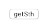
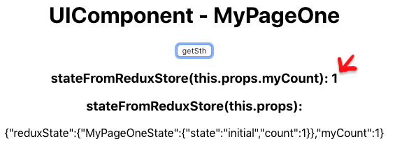

# How to run this project

download and install Node.js

git clone this project

cd redux-tutorial

npm install

npm start

# How Redux works in this project

## How Redux sets up itself in a React project: 

1. Create the Redux Store

1-1. add the reducers you need: 

```javascript
  import { createStore, combineReducers } from 'redux'
  const store = createStore(combineReducers({ MyPageOneState : MyPageOneReducer}))
```

1-2. Allow your App component to access the newly-created Redux Store
```javascript
  render(
      // Allow your App component to use Redux Store
      <Provider store={store}>
        <App />
      </Provider>,
      document.getElementById('root')
  )
```

2. Include the your Redux Container in the entry App component
```javascript
  import MyPageOneContainer from './MyPageOne/redux/container';
  function App() {
    return (
      <div className="App">
        <MyPageOneContainer/>
      </div>
    );
}
```

3. Connect different modules in a Redux Container 

3-1. decide how to map the state returned from reducers to your UI component
```javascript
  const mapStateToProps = state => {
    return {
      reduxState: state, 
      myCount: state.MyPageOneState.count
    }
  }
```

3-2. decide how to map the dispatched functions to your UI component
```javascript
  const mapDispatchToProps = dispatch => {
    return {
        getSth: () => dispatch(getSth())
    }
  }
```


3-3. connect what you did in 3-1 and 3-2 with your UI component, so that you can access the Redux store and function in the UI
```javascript
  const MyPageOneContainer = connect(
    mapStateToProps,
    mapDispatchToProps
  )(UIComponent)
```


## How data flows in a Redux framework: 

1. An user clicks a button(ex. a getSth button) defined in the component.js



2. that button executes the following code in the component.js 
```javascript
  this.props.getSth();
```

3. It checks the mapDispatchToProps function defined in the container.js to find its corresponding dispatched function
```javascript
  const mapDispatchToProps = dispatch => {
    console.log("container.js - mapDispatchToProps() called");
    return {
        getSth: () => dispatch(getSth())
    }
  }
```

4. Behind the scene, once the dispatch(...) method is invoked, the Redux will take the result of the getSth() action as an input, and pass it to the list of reducers you added in the very beginning. 

5. The recuder methods defined in the reducers.js will catch the result of the getSth() action and return the new Redux store. 
```javascript
  function myReducer(state, action) {
    console.log("reducer.js - myReducer() called - action: " , action);  
    console.log("reducer.js - myReducer() called - old state: " , state);  
    if (typeof state === 'undefined') {
      return initialState
    }

    let myState = Object.assign({}, state);
    myState.count = (myState.count + 1);
    console.log("reducer.js - myReducer() called - new state: " , myState);  
    return myState;
  }
```

6. Behind the scene, The retured state from reducers will replace the existing state in the Redux framework.

7. Then, this new state will be passed to the mapStateToProps function defined in the container.js. Here, you define how to map this state to props which can be used in the UI. 
```javascript
  const mapStateToProps = state => {
    console.log("container.js - mapStateToProps() called - state: " , state);    
    return {
      reduxState: state, // this will expose too many information to the client 
      myCount: state.MyPageOneState.count
    }
  }
```

8. Finally, in the UI defined in the component.js, it renders the page according to the changed value in the this.props.myCount. 
```javascript
	render() {
		return (
			<div>
				<h1>UIComponent - MyPageOne</h1>
                		<button onClick={this.getSth}>getSth</button>
				<h3>stateFromReduxStore(this.props.myCount): {this.props.myCount}</h3>
				<h3>stateFromReduxStore(this.props): </h3>
				{JSON.stringify(this.props)}
			</div>
		);
	}	
```

9. Result 




